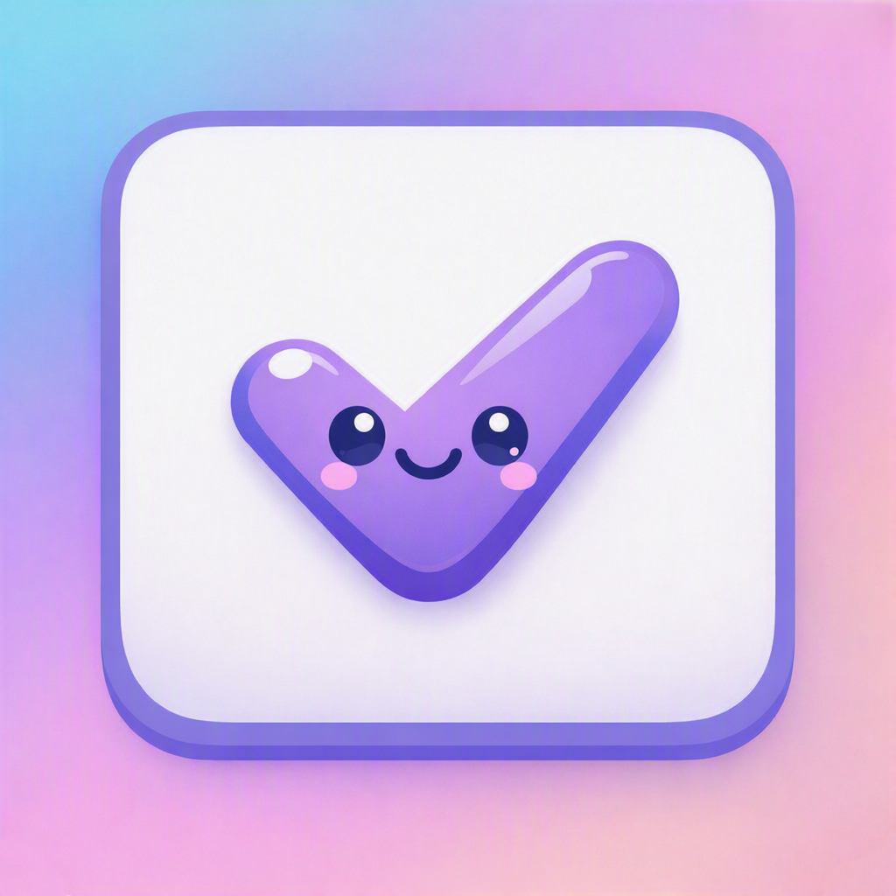

  

# Prima-Focus

[English](README.md) | [Español](README.es.md)

-blue?style=flat)
-4285F4?style=flat&logo=sqlite&logoColor=white)

---

### Descripción del Proyecto
Prima-Focus es una aplicación de gestión de tareas y enfoque profundo "local-first" diseñada para ayudarte a concentrarte en lo que realmente importa. Construida como una **aplicación móvil nativa para Android** con lógica de dominio compartida mediante **Kotlin Multiplatform**, utiliza un avanzado sistema predictivo de puntuación de prioridad para seleccionar dinámicamente tu "Tarea de Hoy". Todos los datos se almacenan localmente en cada dispositivo para garantizar máxima privacidad y rendimiento, con sincronización local peer-to-peer (P2P) mediante Google Nearby Connections sin necesidad de servidores en la nube.

### Puntos Destacados de la Arquitectura
- **Experiencia Insignia en Android (`:app`)**: App nativa completa con base de datos Room v7, diseño Material 3 Glassmorphism, widgets interactivos con Jetpack Glance y recordatorios en segundo plano con WorkManager.
- **Núcleo Modular KMP (`:shared`)**: Motor de prioridad unificado (`SharedPriorityEngine`), cálculo de recurrencias, ventanas de descanso y resolución determinista *Last-Write-Wins* (LWW).
- **Sincronización P2P Flexible Anfitrión / Cliente (Nearby Connections)**:
  - *Móvil a Móvil*: Sincronización directa peer-to-peer con selección explícita del usuario entre modo **Anfitrión ("Ser Anfitrión")** y **Cliente ("Ser Cliente")**, con temporizador de desconexión automática a los 45 segundos para ahorro de batería, límite de seguridad de 5 MB por transferencia y confirmación por dígitos numéricos en ambos dispositivos antes de emparejar.
- **Base de Datos Room v7 (Android)**: Esquema relacional limpio y optimizado con `MIGRATION_6_7` que agrega `missedPolicy` por tarea para las recurrencias saltadas. Soporte completo de borrado lógico (*Soft Deletes* con lápidas `isDeleted`, `deletedAt`) y `syncVersion` incremental para evitar la resurrección de tareas borradas.
- **Resolución de Conflictos LWW Inmune al Clock Drift**: Algoritmo que prioriza la versión lógica antes que el reloj del sistema, tolerando cualquier desfase horario entre dispositivos.
- **No-Regresión de Tareas Completadas**: Las tareas finalizadas permanecen completadas durante el merge independientemente de diferencias en la hora local.
- **Purga Automática de 30 Días**: Recolección de basura (*Garbage Collection*) en SQLite que elimina permanentemente lápidas antiguas al iniciar la app.
- **Diseño Adaptativo en Android**: Interfaz declarativa en Jetpack Compose con soporte para teléfonos, vista dividida con calendario interactivo en tabletas, y `NavigationRail` en anchos medianos/expandidos.
- **Emojis por Categoría**: Cada categoría de tarea muestra un emoji configurable (selector curado + campo de texto libre) en Home, Lista, Inbox y ambos widgets.
- **Tema Adaptativo**: Modo Sistema/Claro/Oscuro más color dinámico Material You (Android 12+), aplicado en vivo sin reiniciar la app.
- **Recurrencias Salteadas**: Un ajuste global y una anulación por tarea deciden si una tarea recurrente vencida (ej. medicación diaria) salta directo a la próxima ocurrencia en vez de acumular instancias atrasadas.
- **Sincronización Reforzada**: IDs deterministas para instancias recurrentes y deduplicación evitan spawns duplicados entre dispositivos, un ID de dispositivo estable desempata conflictos con igual versión, las categorías/tema/recurrencias salteadas se sincronizan junto a las tareas, y un resumen post-merge informa cuántas se recibieron/actualizaron/crearon.
- **Feedback Instantáneo en Widgets**: Completar una tarea desde un widget muestra un check optimista de inmediato y publica una notificación "Deshacer", sin esperar el refresco completo del widget.

### Tecnologías Utilizadas
- **Lenguajes y Frameworks**: Kotlin Multiplatform, Java 17 Toolchain
- **Interfaces Gráficas**: Jetpack Compose (Android), Jetpack Glance (App Widgets)
- **Persistencia Local**: Base de datos Room v7 (Android SQLite)
- **Red y Seguridad**: Google Nearby Connections API (Topología Star P2P)
- **Procesamiento en Segundo Plano**: WorkManager y Foreground Services

### Aprendizajes Clave
Este proyecto representó un gran hito de ingeniería y arquitectura. A lo largo del proceso aprendí a:
- Diseñar y construir una arquitectura modular en **Kotlin Multiplatform (KMP)** con capa de dominio desacoplada.
- Implementar bases de datos locales robustas en móvil (**Room v7**) con seguridad en migraciones y lápidas tombstones.
- Diseñar y someter a auditoría *Red Team* protocolos de red local peer-to-peer con límites de batería y tamaño de paquetes.
- Resolver desafíos de *Clock Drift*, lápidas tombstones y recolección de basura en sistemas distribuidos *local-first*.
- Dominar el diseño de interfaces declarativas con **Jetpack Compose** y widgets con **Jetpack Glance**.

### Índice de Documentación Técnica
Explora nuestra documentación técnica completa para entender cómo funciona Prima-Focus internamente:
- [Arquitectura del Sistema](docs/architecture.md)
- [Esquema de Base de Datos v7](docs/database_schema.sql)
- [Notas de Implementación](docs/implementation_notes.md)
- [Lógica de Prioridades](docs/priority-logic.md)
- [Stress-Test Desktop y Sync LAN](docs/external-references/desktop-kmp-sync-stress-test.md)
- [Flujo de Notificaciones](docs/notification_flow.md)
- [Especificaciones de UI](docs/ui_spec.md)
- [Lecciones: P2P Sync, Tombstones y Clock Drift](docs/learning/p2p-sync-tombstones-clockdrift-gc.md)
- [Todos los Aprendizajes y Decisiones](docs/learning/)

---

## Licencia

Este proyecto está bajo la Licencia MIT. Consulta el archivo [LICENSE](LICENSE) para más detalles.

